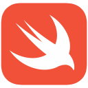

# About me

I really like to run stuff on things that aren't supposed to run said stuff :)

If you are into iOS jailbreaking:
  * [My Repo](https://aptrepo.github.io)
  * [Tweak to remove the Controllcenter bar](https://github.com/legendary-cookie/noccls)

I have experience in these languages (from highest to least):
*  Java
  * [helloworld](https://github.com/legendary-cookie/legendary-cookie/blob/main/HelloWorld.java)
*  Nodejs
  * [helloworld](https://github.com/legendary-cookie/legendary-cookie/blob/main/helloworld.js)
*  Go
  * [helloworld](https://github.com/legendary-cookie/legendary-cookie/blob/main/helloworld.go)
*  C
  * [helloworld](https://github.com/legendary-cookie/legendary-cookie/blob/main/helloworld.c)
*  Rust
  * [helloworld](https://github.com/legendary-cookie/legendary-cookie/blob/main/helloworld.rs)
*  Objective-C
*  C++
  * [helloworld](https://github.com/legendary-cookie/legendary-cookie/blob/main/helloworld.cpp)
*  Kotlin
  * [helloworld](https://github.com/legendary-cookie/legendary-cookie/blob/main/helloworld.kt)
*  Swift
  * [helloworld](https://github.com/legendary-cookie/legendary-cookie/blob/main/helloworld.swift)
*  NASM (jk im a sane person, just some loooow stuff)
  * [helloworld](https://github.com/legendary-cookie/legendary-cookie/blob/main/helloworld.asm)
*  Python
  * [helloworld](https://github.com/legendary-cookie/legendary-cookie/blob/main/helloworld.py)
*  C#
  * [helloworld](https://github.com/legendary-cookie/legendary-cookie/blob/main/helloworld.cs)

